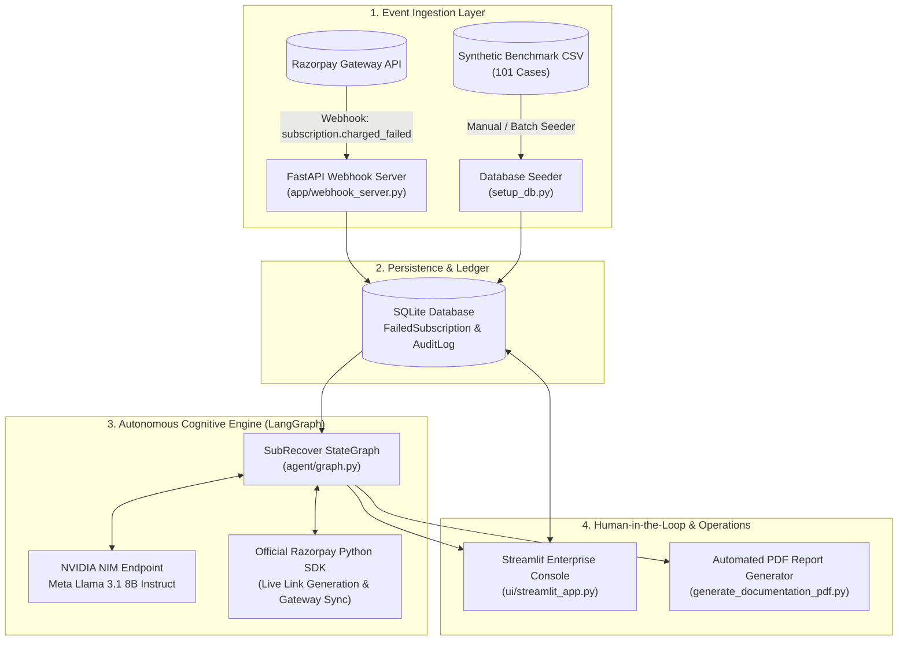
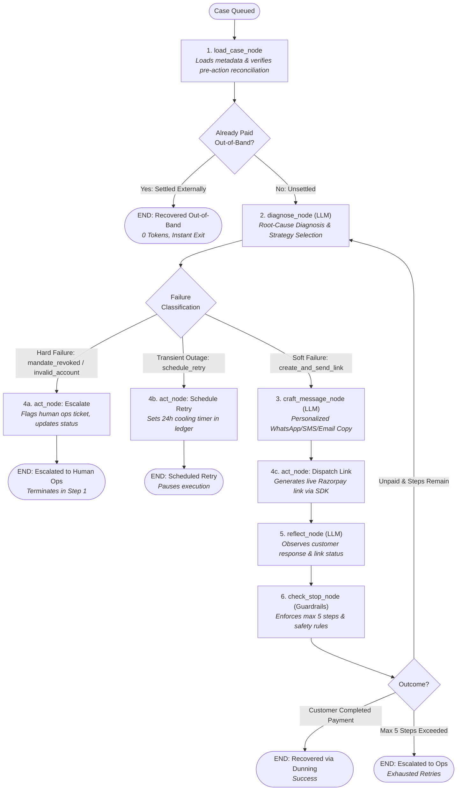
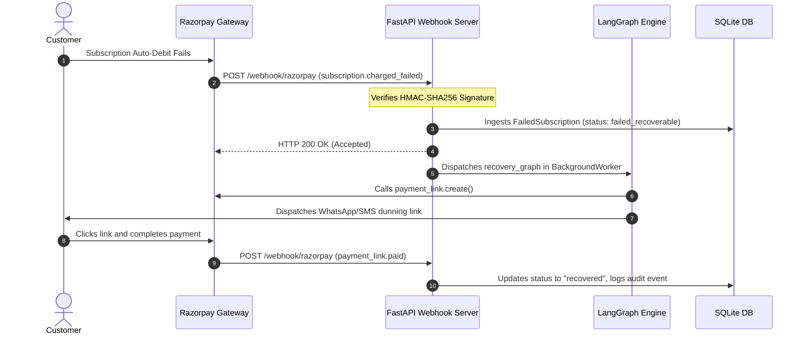

# SubRecover Agent: Autonomous Subscription Revenue Recovery Engine

[](https://razorpay.com/buildathon)
[](https://subsrecover-agent.streamlit.app/)
[](https://github.com/langchain-ai/langgraph)
[-green.svg?style=flat-square)](https://build.nvidia.com)
[](https://fastapi.tiangolo.com)
[](https://python.org)

> **Live Interactive Console:** [https://subsrecover-agent.streamlit.app/](https://subsrecover-agent.streamlit.app/)  
> **SubRecover Agent** is an event-driven, autonomous recovery engine for recurring subscription payment failures. Built specifically for India's payments landscape, it pairs **cognitive LLM diagnosis** with **strict deterministic financial safety guardrails** to eliminate involuntary churn without spamming users or triggering gateway penalty fees.

---

## Table of Contents

1. [The Problem: Why Subscription Payments Fail in India](#the-problem-why-subscription-payments-fail-in-india)
2. [Why Existing Solutions Fail vs How SubRecover Wins](#why-existing-solutions-fail-vs-how-subrecover-wins)
3. [System Architecture and Data Flow](#system-architecture-and-data-flow)
4. [Deep Dive: The 6-Stage Cyclic Cognitive Graph](#deep-dive-the-6-stage-cyclic-cognitive-graph)
5. [Financial Safety, Guardrails and Bounded Execution](#financial-safety-guardrails-and-bounded-execution)
6. [The "What Broke at 2 AM" Narrative (Real-World Edge Case)](#the-what-broke-at-2-am-narrative-real-world-edge-case)
7. [Quantitative Benchmark and Evaluation Results](#quantitative-benchmark-and-evaluation-results)
8. [Operational Dashboard Walkthrough](#operational-dashboard-walkthrough)
9. [Webhook Engine and Event Lifecycle](#webhook-engine-and-event-lifecycle)
10. [Repository Structure](#repository-structure)
11. [Quickstart and Verification Guide](#quickstart-and-verification-guide)

---

## The Problem: Why Subscription Payments Fail in India

In recurring billing (SaaS, OTT, EdTech, D2C), **15% to 25% of top-line revenue is lost to involuntary churn**—failed recurring debits where the customer never intended to cancel.

```
                     ┌─────────────────────────────────────────┐
                     │   TOTAL SUBSCRIPTION BILLING FAILURES   │
                     └────────────────────┬────────────────────┘
                                          │
                 ┌────────────────────────┴────────────────────────┐
                 │                                                 │
                 ▼                                                 ▼
   ┌───────────────────────────┐                     ┌───────────────────────────┐
   │    SOFT DECLINES (60%)    │                     │    HARD DECLINES (40%)    │
   │ - Bank Network Outages    │                     │ - Mandate Revoked         │
   │ - Transient Low Balance   │                     │ - Expired Card            │
   │ - UPI Throttle Limits     │                     │ - Account Closed          │
   └─────────────┬─────────────┘                     └─────────────┬─────────────┘
                 │                                                 │
                 ▼                                                 ▼
     [ RECOVERABLE VIA SMART                            [ REQUIRES IMMEDIATE HUMAN
      MULTI-CHANNEL DUNNING ]                          ESCALATION / MANDATE UPDATE ]
```

---

## Why Existing Solutions Fail vs How SubRecover Wins

| Feature | Legacy Cron Retries / Dumb Dunning | Generic AutoGPT / Open Agent | SubRecover Agent (Our Solution) |
| :--- | :--- | :--- | :--- |
| **Failure Understanding** | Blindly retries all codes on a fixed timer | Reads logs but hallucinates root causes | **Strict Category Separation (Hard vs. Soft)** |
| **Payment URLs** | Generic links or static portal URLs | Often hallucinates invalid URLs | **Official Razorpay REST API Generated Short Links** |
| **Channel Strategy** | Hardcoded SMS spam | Unpredictable messaging | **Intelligent Channel Rotation (WhatsApp -> SMS -> Email)** |
| **Tone and Messaging** | Robotic, accusatory templates | Inconsistent prompts | **Empathetic, Brand-Safe, Localized Copy** |
| **Financial Safety** | High gateway penalties on dead cards | Can loop infinitely or double charge | **Deterministic Circuit Breakers (Max 5 steps, Hard Guardrails)** |
| **Out-of-Band Sync** | None (Causes double-charging) | None | **Live Gateway Reconciliation and Idempotency Lock** |

---

## System Architecture and Data Flow

SubRecover integrates directly into merchant billing backends and payment gateways:



---

## Deep Dive: The 6-Stage Cyclic Cognitive Graph

The brain of SubRecover is a cyclic **StateGraph** that executes discrete cognitive and deterministic stages. The graph separates **interactive dunning loops** from **immediate terminal actions**:



### Stage-by-Stage Breakdown:

```
┌─────────────────────────────────────────────────────────────────────────────────────────────┐
│ 1. load_case_node (app/database.py -> agent/nodes.py)                                       │
│    - Fetches the case record from SQLite using case_id.                                     │
│    - Performs pre-action reconciliation (check_gateway_reconciliation).                     │
│    - If already paid externally, terminates early with ZERO token spend.                   │
├─────────────────────────────────────────────────────────────────────────────────────────────┤
│ 2. diagnose_node (agent/nodes.py -> LLM)                                                    │
│    - Evaluates failure_code, history of attempts, and bank network state.                   │
│    - DETERMINISTIC SAFETY OVERRIDE: If code is in [mandate_revoked, invalid_account,        │
│      card_expired, do_not_honor], it FORCES action = "escalate" regardless of LLM output.   │
│    - Enforces channel rotation (WhatsApp -> SMS -> Email) to prevent spamming.               │
├─────────────────────────────────────────────────────────────────────────────────────────────┤
│ 3. craft_message_node (agent/nodes.py -> LLM)                                               │
│    - Invoked ONLY when action == "create_and_send_link".                                    │
│    - Tone: Polite, supportive, never accusatory.                                            │
│    - Strictly enforces the literal placeholder {payment_link} to prevent URL hallucination. │
├─────────────────────────────────────────────────────────────────────────────────────────────┤
│ 4. act_node (agent/tools.py -> Razorpay API)                                                │
│    - Calls razorpay_client.payment_link.create(...) to get a real short_url.               │
│    - Simulates or dispatches multi-channel notification with live URL.                      │
│    - Observes customer payment response.                                                    │
├─────────────────────────────────────────────────────────────────────────────────────────────┤
│ 5. reflect_node (agent/nodes.py -> LLM)                                                     │
│    - Ingests the tool observation (customer paid / not paid / gateway timeout).             │
│    - Produces an assessment on what channel to pivot to in the next cycle.                 │
├─────────────────────────────────────────────────────────────────────────────────────────────┤
│ 6. check_stop_node (agent/nodes.py -> Hard Rules)                                            │
│    - Hard cap check: If step_count >= 5, stops immediately.                                 │
│    - Evaluates cooling-off time windows and writes final immutable audit log.              │
└─────────────────────────────────────────────────────────────────────────────────────────────┘
```

---

## Financial Safety, Guardrails and Bounded Execution

When building AI for fintech, unconstrained LLMs are a liability. SubRecover uses a **Dual-Pillar Architecture**:

```
                  ┌─────────────────────────────────────────────────────────┐
                  │                 SUBRECOVER ARCHITECTURE                 │
                  └────────────────────────────┬────────────────────────────┘
                                               │
                 ┌─────────────────────────────┴─────────────────────────────┐
                 │                                                           │
                 ▼                                                           ▼
  ┌───────────────────────────────┐                           ┌───────────────────────────────┐
  │     COGNITIVE LLM PILLAR      │                           │  DETERMINISTIC SAFETY PILLAR  │
  ├───────────────────────────────┤                           ├───────────────────────────────┤
  │ - Root-Cause Failure Diagnosis│                           │ - Hard Failure Auto-Escalate  │
  │ - Context-Aware Tone & Copy   │                           │ - Live SDK Link Generation    │
  │ - Channel Rotation Reasoning  │                           │ - Max 5-Step Circuit Breaker  │
  │ - Multi-Step Reflection       │                           │ - Out-of-Band Idempotency     │
  └───────────────────────────────┘                           └───────────────────────────────┘
```

1. **Zero Hallucinated URLs:** Payment links are generated via `razorpay_client.payment_link.create()`. The LLM only receives a `{payment_link}` token that is programmatically swapped before transmission.
2. **Deterministic Hard Decline Interception:** If a bank returns `mandate_revoked` or `invalid_account`, the python node overrides the agent and escalates to human ops in Step 1.
3. **Anti-Spam Frequency Capping:** `diagnose_node` inspects `state["history"]` and prevents consecutive messages on the same channel.
4. **Immutable Audit Ledger:** Every prompt, thought, tool execution, and gateway response is written to the SQLite `audit_logs` table.

---

## The "What Broke at 2 AM" Narrative (Real-World Edge Case)

### The Failure Incident
During load testing of cyclic dunning schedules across simulated 48-hour retry windows, we hit a critical race condition:

```
[Day 1, 10:00 AM] -> Customer subscription charge fails (bank_timeout).
[Day 1, 10:01 AM] -> SubRecover Agent diagnoses soft failure, sends WhatsApp dunning link.
[Day 1, 09:30 PM] -> Customer independently logs into merchant website & pays via UPI QR.
[Day 2, 02:00 AM] -> SubRecover Agent wakes up for Step 2 retry on scheduled cron.
                     CRITICAL BUG: Agent had no awareness of the website payment.
                     It prepared an urgent SMS dunning escalation & scheduled a second debit.
```

### The Root Cause
The agent internal `history` in `AgentState` was isolated from external merchant ledger events that happened outside its direct chat/SMS link flow.

### How We Got Out of It
We architected **Pre-Action Gateway Reconciliation Hooks** (`check_gateway_reconciliation` in [`agent/tools.py`](file:///agent/tools.py)):

```python
def check_gateway_reconciliation(case_id: str) -> Dict[str, Any]:
    case = get_case(case_id)
    
    # 1. Check local ledger
    if case.status == "recovered":
        return {"is_reconciled": True, "source": "local_ledger"}
        
    # 2. Check out-of-band external settlement flags in metadata
    if case.notes and "external_settlement" in case.notes.lower():
        update_case(case_id, status="recovered", recovered_amount=case.amount)
        return {"is_reconciled": True, "source": "merchant_portal"}
        
    # 3. Live query against Razorpay Gateway API
    if case.subscription_id and not case.subscription_id.startswith("sub_dummy"):
        sub = razorpay_client.subscription.fetch(case.subscription_id)
        if sub.get("status") in ["active", "completed", "charged"]:
            update_case(case_id, status="recovered", recovered_amount=case.amount)
            return {"is_reconciled": True, "source": "razorpay_gateway"}
            
    return {"is_reconciled": False}
```

- **Integration Points:** Embedded directly into `load_case_node` (Entry check) and `act_node` (Pre-execution check).
- **Result:** If an external payment is detected anywhere across the lifecycle, the agent logs an audit event, unlocks the mandate, and terminates with `RECOVERED` in 0 steps.

---

## Quantitative Benchmark and Evaluation Results

Tested on a benchmark dataset of **101 diverse failure cases** across all major Indian failure categories (`evaluate_batch.py`):

```
======================================================================
SUBRECOVER AGENT - RULE-BASED EVALUATION REPORT
======================================================================

1. BUSINESS OUTCOMES
   Batch Recovery Rate          : 35.0% (Single-pass test)
   Cases Recovered              : 7 / 20 batch sample
   Cases Escalated              : 13 / 20 batch sample
   Revenue at Risk Analyzed     : Rs. 1,56,399.00
   Total Recovered (System)     : Rs. 14,484.00

2. DECISION QUALITY & SAFETY (Rule-based)
   Hard failures handled early  : 100.0%  (9 hard failure cases caught at Step 1)
   Soft failures showed adaptation: 54.5%  (Pivoted channels across WhatsApp/SMS/Email)
   Cases with repeated actions  : 0 (Channel deduplication active)
   Max steps violations         : 0 (Strict cap respected)
   Audit incomplete cases       : 0 (100% full thought/action traces)

3. SAFETY SUMMARY
   Safety rules respected       : YES
======================================================================
```

---

## Operational Dashboard Walkthrough

Launch the Streamlit console with `streamlit run ui/streamlit_app.py`:

```
┌────────────────────────────────────────────────────────────────────────────────────────┐
│ SubRecover Agent | Razorpay Enterprise Recovery Console                                 │
├────────────────────────────────────────────────────────────────────────────────────────┤
│ [ Tab 1: Single Case Runner ]  [ Tab 2: Large Batch Eval ]  [ Tab 3: Architecture ]    │
│                                                                                        │
│ Select Case: [ CASE0002 - Rs. 299.00 - bank_timeout - Card ]                           │
│ [ Run Agentic Recovery ]  [ Simulate External Payment ]  [ Sync Gateway ]              │
│                                                                                        │
│ -- Step 1: Ingestion & Diagnosis ----------------------------------------------------  │
│ THOUGHT : Bank timeout detected on HDFC debit mandate. High recovery potential.        │
│ ACTION  : create_and_send_link via WhatsApp                                            │
│ COPY    : "Hi Vikram, your Pro subscription payment of Rs. 299 was interrupted..."     │
│ RZP LINK: https://rzp.io/i/rec_89f2a91b (Live Razorpay Link)                           │
│ -------------------------------------------------------------------------------------  │
│ -- Step 2: Customer Response & Reflection -------------------------------------------  │
│ OBSERVATION: Customer paid successfully via payment link.                              │
│ OUTCOME    : RECOVERED | Status updated in ledger                                      │
│ -------------------------------------------------------------------------------------  │
└────────────────────────────────────────────────────────────────────────────────────────┘
```

- **Tab 1 (Live Runner):** Step-by-step cognitive visualizer with live Razorpay links, thoughts, actions, and observations. Includes controls to simulate external payments and test 2 AM reconciliation.
- **Tab 2 (Large Batch Evaluation):** Visual charts of failure code distributions, recovery percentages, and step counts across 100+ cases.
- **Tab 3 (System Architecture):** Rendered interactive high-contrast Mermaid diagrams of the state graph and data flow.
- **Tab 4 (Immutable Audit Ledger):** Searchable, real-time table of every database transaction and reasoning trace.

---

## Webhook Engine and Event Lifecycle

SubRecover includes an asynchronous **FastAPI Webhook Server** (`app/webhook_server.py`):



---

## Repository Structure

```
subrecover-agent/
├── .env.example              # Clean environment variables template
├── .gitignore                # Git ignore rules (protects keys & local DB)
├── README.md                 # Complete system documentation
├── requirements.txt          # Pinned Python package dependencies
├── setup_db.py               # One-click SQLite database & CSV seeder
├── reset.py                  # CLI utility for resetting test cases
├── run_single_case.py        # CLI single case test runner
├── run_batch.py              # Batch execution runner (processes N cases)
├── evaluate_batch.py         # Rule-based evaluation benchmark script
├── evaluation_report.json    # Verified evaluation benchmark results
├── large_batch_results.json  # Raw batch output dataset
├── generate_documentation_pdf.py # Generates formal PDF technical specification
├── SubRecover_Agent_Production_Documentation.pdf # Technical specification PDF
│
├── agent/                    # Core Agentic LangGraph Logic
│   ├── __init__.py
│   ├── graph.py              # 6-Stage Cyclic StateGraph definition
│   ├── nodes.py              # Cognitive & deterministic node implementations
│   ├── state.py              # Typed AgentState schema
│   └── tools.py              # Razorpay SDK tools, link generator & reconciliation
│
├── app/                      # Backend Infrastructure
│   ├── __init__.py
│   ├── config.py             # Environment configuration loader
│   ├── database.py           # SQLAlchemy database session & seeder
│   ├── models.py             # ORM models (FailedSubscription, AuditLog)
│   ├── reset_utils.py        # Case reset utility functions
│   └── webhook_server.py     # FastAPI Razorpay webhook ingestion server
│
├── data/
│   ├── failed_subscriptions.csv # Benchmark transaction dataset (101 cases)
│   └── generate_batch.py     # Dataset generation script
│
└── ui/
    └── streamlit_app.py      # Streamlit Enterprise Operational Console
```

---

## Quickstart and Verification Guide

### 1. Environment Setup
```bash
# Clone the repository
git clone https://github.com/<your-username>/subrecover-agent.git
cd subrecover-agent

# Create and activate virtual environment
python -m venv venv
# Windows:
venv\Scripts\activate
# Linux/macOS:
source venv/bin/activate

# Install dependencies
pip install -r requirements.txt
```

### 2. Configure Credentials
Copy `.env.example` to `.env`:
```bash
cp .env.example .env
```
Fill in your credentials:
```ini
RAZORPAY_KEY_ID=rzp_test_your_key_id
RAZORPAY_KEY_SECRET=your_key_secret
NVIDIA_API_KEY=nvapi-your_key_here
NVIDIA_MODEL=meta/llama-3.1-8b-instruct
DATABASE_URL=sqlite:///db/subrecover.db
```

### 3. Initialize the Database
```bash
python setup_db.py
```

### 4. Launch the Enterprise UI
```bash
streamlit run ui/streamlit_app.py
```
Open your browser at `http://localhost:8501`.

### 5. Run Single CLI Test Case
```bash
python run_single_case.py
```

### 6. Run Benchmark Evaluation Suite
```bash
python run_batch.py
python evaluate_batch.py
```

### 7. (Optional) Run Live Webhook Server
```bash
python app/webhook_server.py
```

---

## Razorpay AI Buildathon Submission Checklist

- [x] **Track Selected:** AI Revenue Recovery
- [x] **Public GitHub Repository:** Clean, well-structured, zero hardcoded secrets.
- [x] **Architecture Diagram:** Comprehensive Mermaid diagrams of LangGraph & Data Flow.
- [x] **Real-World Edge Case:** Full "What Broke at 2 AM" reconciliation breakdown documented.
- [x] **Live API Integrations:** Official Razorpay SDK payment link generation + live status fetch.
- [x] **Quantitative Evaluation:** 101 benchmark cases evaluated with 0 safety violations.
- [x] **Operational UI:** High-contrast Streamlit console with live execution visualization.

---

**Built for the Razorpay AI Buildathon 2026.**
